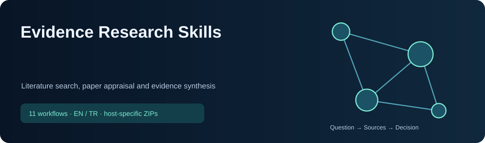

<!-- CURRENT-SKILL-PUBLICATION -->

# Evidence Research Skills

Literature search, paper appraisal and evidence synthesis. These **11 workflows** help the assistant select tools, check evidence and produce reviewable results. They do not change model weights or guarantee better decisions.

 

**ChatGPT:** the button downloads a plugin with all listed skills and supporting files. Use the personal-plugin/skill import supported by your account. A single-skill ChatGPT button downloads a one-skill plugin. **Claude:** unpack the collection ZIP, then upload its individual skill ZIPs; the outer collection is not a single Claude skill. Local Codex/Claude Code files and cloud-account installation are separate.

Use natural English or Turkish requests. For medical workflows: “literatür: frozen shoulder exercises”, “literature: exercise dose”, “makale/paper: DOI”, “fizyo/physio: case”. A slash-prefixed word typed in chat does not register a host command. Explicit local skill invocation uses the canonical skill name; available tools, network access and credentials remain host-dependent.

## Included skills

| Skill | What it solves / example request | ChatGPT | Claude |
|---|---|---|---|
| [`medical-evidence-research`](skills/common/medical-evidence-research/SKILL.md) | Search PubMed/PEDro, appraise papers and track evidence | [↓ ZIP](packages/chatgpt/medical-evidence-research.zip) | [↓ ZIP](packages/claude/medical-evidence-research.zip) |
| [`physio-clinical-copilot`](skills/common/physio-clinical-copilot/SKILL.md) | Reason through cases, measures, rehabilitation and patient education | [↓ ZIP](packages/chatgpt/physio-clinical-copilot.zip) | [↓ ZIP](packages/claude/physio-clinical-copilot.zip) |
| [`research-analyst`](skills/common/research-analyst/SKILL.md) | Research, verify claims and compare supporting and opposing evidence | [↓ ZIP](packages/chatgpt/research-analyst.zip) | [↓ ZIP](packages/claude/research-analyst.zip) |
| [`primary-source-research`](skills/common/primary-source-research/SKILL.md) | Verify a question from official and first-party sources | [↓ ZIP](packages/chatgpt/primary-source-research.zip) | [↓ ZIP](packages/claude/primary-source-research.zip) |
| [`gemini-deep-research`](skills/common/gemini-deep-research/SKILL.md) | Run sourced research with available Gemini integration | [↓ ZIP](packages/chatgpt/gemini-deep-research.zip) | [↓ ZIP](packages/claude/gemini-deep-research.zip) |
| [`parallel-web`](skills/common/parallel-web/SKILL.md) | Research multiple sources with available Parallel integration | [↓ ZIP](packages/chatgpt/parallel-web.zip) | [↓ ZIP](packages/claude/parallel-web.zip) |
| [`academic-study-coach`](skills/common/academic-study-coach/SKILL.md) | Learn a topic, summarize a paper, prepare for an exam | [↓ ZIP](packages/chatgpt/academic-study-coach.zip) | [↓ ZIP](packages/claude/academic-study-coach.zip) |
| [`data-analyst`](skills/common/data-analyst/SKILL.md) | Analyze tables, statistics, data quality and metrics | [↓ ZIP](packages/chatgpt/data-analyst.zip) | [↓ ZIP](packages/claude/data-analyst.zip) |
| [`ai-research-skills`](skills/common/ai-research-skills/SKILL.md) | Develop research ideas, experiments and scientific writing | [↓ ZIP](packages/chatgpt/ai-research-skills.zip) | [↓ ZIP](packages/claude/ai-research-skills.zip) |
| [`graphify`](skills/common/graphify/SKILL.md) | Map relationships across code, documents and research | [↓ ZIP](packages/chatgpt/graphify.zip) | [↓ ZIP](packages/claude/graphify.zip) |
| [`office-docs-qa`](skills/common/office-docs-qa/SKILL.md) | Read and check PDF, Word, spreadsheets and presentations | [↓ ZIP](packages/chatgpt/office-docs-qa.zip) | [↓ ZIP](packages/claude/office-docs-qa.zip) |

## Installation and technical boundaries

- Full canonical sources: `skills/common/`; provider packages: `packages/chatgpt/`, `packages/claude/`, `packages/codex/`.
- Every Claude skill has at most 200 files and a description of at most 200 characters. ZIPs include all files of the selected provider source; `ai-research-skills` has a pre-existing cloud subset and a separate full local source.
- External services (Gemini, Parallel, Context7), local CLIs and subscriptions are not provided by these ZIPs. Report missing tools rather than simulating access.
- Validation checks package integrity, paths, descriptions, source/package parity and hashes. It is not a live account-installation test or a clinical/financial effectiveness claim.
- See [checksums](downloads/SHA256SUMS.txt), [provenance](PUBLICATION.md), and [third-party notices](THIRD_PARTY_NOTICES.md). Existing license and copyright files retain their scope; there is no blanket license grant over third-party content.

Clinical outputs distinguish abstracts from full texts, study quality from reporting, and statistical significance from clinical importance. Evidence workflows support professional judgment; they do not diagnose an individual or replace a clinician.

[AI research security repair / Güvenlik düzeltmesi](AI-RESEARCH-SECURITY.md): 98 local / 10 cloud modules retained; explicit scope, privacy and permission boundaries.

## From question to defensible evidence / Sorudan kanıta

1. Define a PICO/PECO or diagnostic/measurement question, population, outcomes and eligibility criteria.
2. Search PubMed/MEDLINE and relevant PEDro, DiTA, Cochrane/CENTRAL and allied-health sources. Combine controlled vocabulary with text synonyms; translate syntax per database. Add Turkish/English TR Dizin, DergiPark and YÖK searches when relevant.
3. Record database, exact query, date, filters and retrieval count; deduplicate and explain screening decisions. Track access limits rather than claiming inaccessible sources were searched.
4. Verify DOI/PMID, publication version, peer review, corrections/retractions and full-text access. Use study-design-appropriate appraisal; separate risk of bias from reporting quality, effect sizes from p-values, and ICC/SEM/MDC/MCID from each other.
5. Compare supporting and conflicting findings, applicability, uncertainty and clinical importance. Do not present an abstract-only read as a full-text appraisal. Reuse a saved query for updates; actual recurring alerts require user scheduling authorization.

See the skill's [source map](skills/common/medical-evidence-research/references/source-map.md) and [search strategy](skills/common/medical-evidence-research/references/search-strategy.md). Youthall and Marmara's supplied pages are discovery guides; DergiPark hosts journals. None replaces study-level appraisal.

Türkçe örnek: “Literatür tara: donuk omuzda egzersiz dozu; arama dizgilerini göster, karşıt çalışmaları da bul ve klinik önemi açıkla.”
English example: “Appraise this rehabilitation paper; verify its version, methods, effect sizes, bias and applicability, and label any unavailable full text.”

<!-- END-CURRENT-SKILL-PUBLICATION -->

